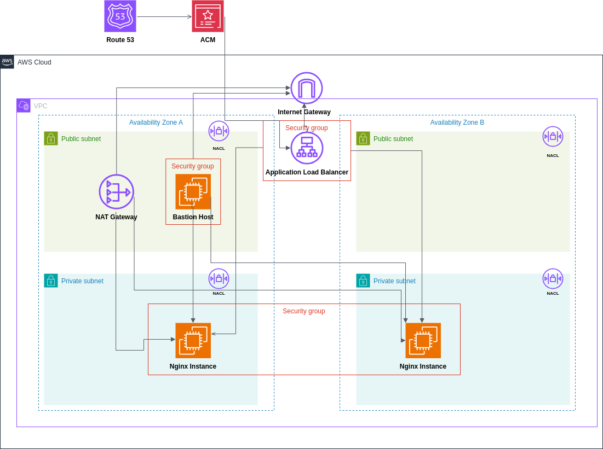
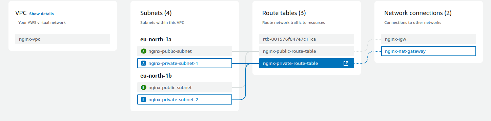
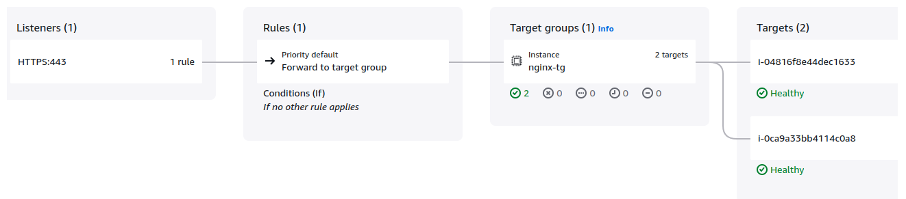

# NGINX Containerized with an AWS architucture

Hello there, i created a highly available, fault tolerance and secure AWS architucture followed by best practices. I deployed the whole infrastructure with Terraform and devided it into modules for better logical understanding.



## Dockerfile Creation and pushing to Dockerhub

I created a simple Dockerfile for the new Nginx container, the container is exposed on port 80. In the docker file itself i inject the `RUN echo "yo this is nginx" > /usr/share/nginx/html/index.html`. This command recreates the index.html file and echos the "yo this is nginx". To run the container and text it locally i ran the command:

````bash
docker run -p 8080:80 keretdodor/nginx-moveo
````
After the test is done, i tagged and pushed the image to my Dockerhub repository.
## S3 bucket for Terraform backend

To ensure security and best practices, i stored the `tfstate` file in an **S3 bukcet**  when **versioning** enabled for possible rollbacks.

## Network module on Terraform


**Virtual Private Cloud (VPC):** A dedicated, logically isolated network for the application, with CIDR block `10.0.0.0/16`.

<u><b>Subnets and High Availability:</b></u>

***Two Public Subnets:***

The public subnets are in separate Availability Zones (AZs), which ensures redundancy and availability even if one AZ fails.
These subnets host resources that need to be exposed to the internet, such as the bastion host and load balancer. 

 * *In reality to maintain true high availability we will create a bastion host on each subnet.*

***Two Private Subnets:***

These subnets are also spread across two AZs for high availability.
They host NGINX instances and restrict their direct exposure to the internet, adding a layer of security.

<u><b>Internet Gateway and NAT Gateway:</b></u>

The **Internet Gateway** allows public subnets to communicate with the internet.

The **NAT Gateway** enables private subnets to initiate outbound internet traffic without exposing them to inbound traffic. An **Elastic IP** is attached to the NAT Gateway ensuring future whitelisting and consistency.

<u><b>Route Tables:</b></u>

I created two route table to create a complete netwrok isolation one for the public subnets and the other for the private ones.

**Public subnets** route through the **Internet Gateway** for external communication.

**Private subnets** route through the **NAT Gateway** for secure and one sided internet access.

 <u><b>NACLs:</b></u>

The Network Access Control Lists (NACLs) provide an additional layer of security for both public and private subnets in our VPC infrastructure. The public subnet NACL allows inbound SSH and HTTPS traffic from any source, while enabling all outbound communication. The private subnet NACL restricts inbound access to SSH from the bastion host and HTTP from within the VPC, ensuring controlled and secure network access. These stateless firewall rules complement the existing security groups, offering granular network-level protection for our AWS-deployed application.



<u><b>Bastion Host for Administrative Access:</b></u>

A bastion host is deployed in a public subnet. With the bastion host we can securely connect to any instance on a private subnet within the same VPC.
The bastion host has a dedicated key pair crteated locally and uploaded to aws with the `aws_key_pair` resource.

* *In production environment access to the bastion host is restricted to only trusted IP ranges (such as the company's IPs), enforcing security best practices.*

## Nginx module on Terraform

This module includes both the **Ngnix Instances** and the **Application Load Balancer**.

<u><b>Ngnix Instances:</b></u>

I created two Nginx instances deployed on two different private subnet within two different AZs. The Nginx instances have adedicated key pair crteated locally and uploaded to aws with the `aws_key_pair` resource. 

To ensure maximum security, i created a security group that is based on the **least privilege principle**. The security group only accepts inbound traffic on port 80 from the **Load Balancer's SG**  and on port 22 for SSH connection from the **Bastion Host's private IP address**.

Outbound traffic is possible due to the existence of the **NAT Gateway**.


<u><b>Load Balancer:</b></u>


The Load Balancer type is application, it is a LB that functions in Layer 7 of the OSI model and acccepts HTTP and HTTPS protocols.

The ALB listens to traffic coming from port 433 (HTTPS Protocol),  to ensure only secured traffic is coming, then it forwards the traffic. it is possible due to the usage of a **certificate**, i personally used the **AWS CM** to create one to myself.

The traffic is then forwarded to port 80 (HTTP) to make the developer's life easier by not having the need to deal with certificates.

The ALB security group is also based on the **least privilege principle**. The security group only accepts inbound traffic on port 433 from **everywhere**, and sends traffic (outbound traffic) on port 80 to the **VPC CIDR range**

I also created an **A record with alias on AWS Route 53**, making sure it is easier for clients to access the application publicly. 


## Bonus part (Github Actions Workflow) and installation

I created a CI/CD pipeline that is triggered by a `git commit` and `git push` commands to the main branch of the repository. 

The pipeline uses AWS credentials (Access Key ID and Secret Access Key) that are saved as **Secrets** to log in AWS along with a region that is specified as a env var. Then, a script is being executed, it takes the two secrets `BASTION_PRIVATE_KEY` and `NGINX_PRIVATE_KEY` and saves them as files that are later being used in the `locals.tf`. At the end, the two commands `terraform init` and `terraform apply` are being executed and the whole infrastructure is deployed

### Installation

We will first need to create two keys locally, the two public keys should be later moved to the /tf directory for simplicity
````bash
ssh-keygen -t rsa -b 2048 -f ~/path/to/file/nginx-key-moveo
ssh-keygen -t rsa -b 2048 -f ~/path/to/file/bastion-key-moveo
````
Create the following secrets for the private keys on Github Secrets :

- `BASTION_PRIVATE_KEY`
- `NGINX_PRIVATE_KEY`

**Create a Hosted Zone for a GoDaddy Domain**

- Step 1 >> Log in to the AWS Management Console and go to the Route 53 service.  
- Step 2 >> Click Hosted Zones, then Create Hosted Zone.  
- Step 3 >> Enter your domain name (e.g., example.com) and choose Public Hosted Zone.  
- Step 4 >> Copy the Name Servers (NS) from the created hosted zone.  
- Step 5 >> Log in to GoDaddy, go to My Products, and manage your domain.  
- Step 6 >> Update the domain's Nameservers with the NS values from Route 53.  
- Step 7 >> Save changes and wait for DNS propagation (can take up to 48 hours). 

**Create AWS Access Key and Access ID**

- Step 1 >> Log in to the AWS Management Console and go to the IAM service.  
- Step 2 >> Click Users and select the user you want to generate keys for, or create a new user.  
- Step 3 >> In the user settings, go to the Security credentials tab.  
- Step 4 >> Click Create access key, select CLI use case and follow the prompts.  
- Step 5 >> Save the Access Key ID and Secret Access Key securely.

Create the following secrets for the AWS Access Key and Access ID on Github Secrets :

- `AWS_ACCESS_KEY_ID`
- `AWS_SECRET_ACCESS_KEY`

And also the following variable

- `AWS_REGION`

**Create a Certificate in AWS ACM**

- Step 1 >> Log in to the AWS Management Console and go to the ACM service.  
- Step 2 >> Click on "Request a certificate".  
- Step 3 >> Choose "Public certificate" and click "Request".  
- Step 4 >> Enter your domain name and also *. of you domain name (example.com and *.example.com) and click "Next".  
- Step 5 >> Choose a DNS validation 
- Step 6 >> For DNS validation, add the CNAME record to your domain's DNS settings (provided by ACM).   
- Step 7 >> Wait for ACM to issue the certificate once validation is complete.

**local.tf values** 

Now in the `local.tf` file, customize the following variables as you need and like: 

  `region                       = "<-your-value->"`
  `alias_record                 = "<-your-value->"`
  `instance_type                = "<-your-value->"`
  `cert_arn                     = "<-your-value->"`

**commit and push**

When you are done, do both commit and push to your repository with the updated `locals.tf` file and that's it! you have your own nginx application


